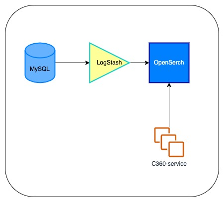

# Rudxiee
## Proof of Concept

In order to use OpenSearch, the first problem to solve is: how do we send current and future data from our relational database?
For this we need to implement the following architecture:

### Requisites

#### On MySQL

- “airports” table where the data is stored.

- “airports_journal” table where the create, update or delete operations performed on the main table are saved.

- Have the triggers when INSERT, UPDATE or DELETE operation is performed on "airports" table.

#### On Logstash

- “sync_airports” pipeline with which the data is getting from the source, transforms it and sends it to its destination.

#### On OpeSearch

- "airports" index where is stored each airport document for do it searching operations.

### How does it work?

1. Every time an INSERT, UPDATE, or DELETE operation is performed on the “airports” table, the corresponding trigger will save the operation to the “airports_journal” table.

2. The “sync_airports” pipeline runs every 5 seconds looking for the last operations performed on the “airports” table. It transforms the data and sends the data performing the corresponding operation to OpenSearch.

3. Search the airport data within OpenSearch through the Query DSL

   
Zapoteco istmeño: 
rudxiee - remover con algún objeto, revolver. 
rudxiee ná' - remover con la mano, escudriñar, buscar, registrar a una persona. 